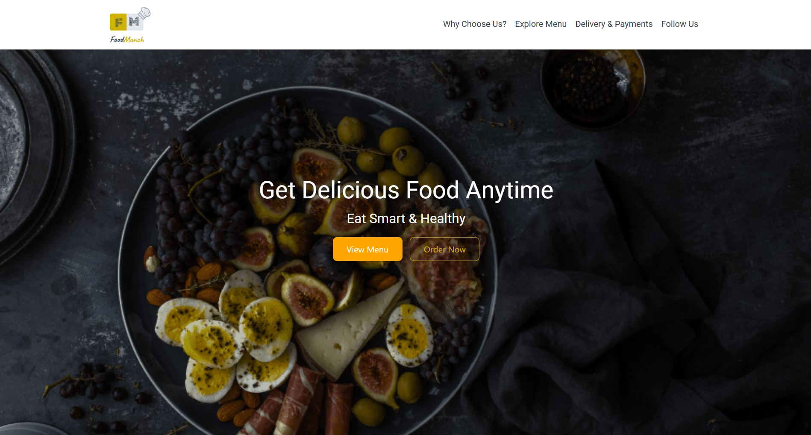
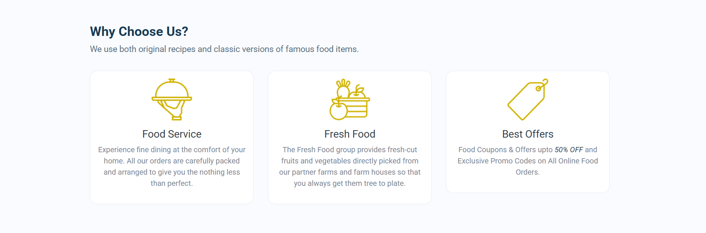
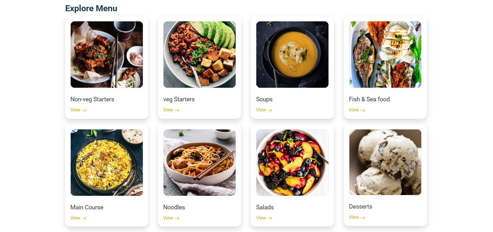

# 🍔 Food Ordering Website

## 📌 Overview
A responsive food ordering website interface designed to provide users with a seamless browsing experience. The project emphasizes clean UI design and intuitive navigation.

## 🚀 Features
- Responsive and mobile-friendly design
- Clean and modern user interface
- Easy navigation between sections
- Well-structured layout for better usability

## 🛠️ Tech Stack
- HTML5
- CSS3

## 🎯 Key Highlights
- Focused on improving user experience with simple UI design
- Built reusable and structured components
- Ensured cross-device compatibility

## 🔗 Live Demo
👉 https://orderproject.ccbp.tech/

## 📷 Screenshots

## 👨‍💻 Author
*Tanikonda Pavan Kumar*  
B.Tech CSE | Aspiring Software Engineer
